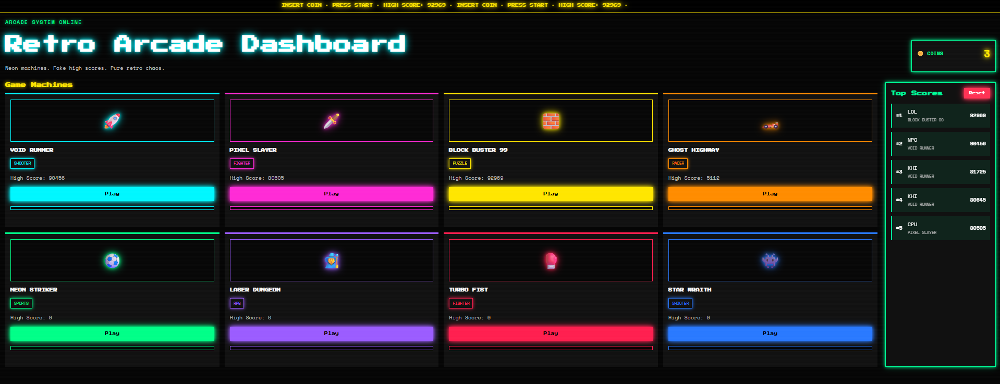

# 🎮 Retro Arcade Dashboard

A neon-styled retro arcade launcher built with HTML, CSS, and vanilla JavaScript.

This project recreates the feeling of an 80s arcade cabinet UI with glowing game cards, fake loading systems, live scoreboards, retro sound effects, localStorage saves, and animated neon visuals.

---

## 🚀 Live Demo

https://fazal305.github.io/retro-arcade-dashboard/

---

## 📸 Screenshot

### Arcade Dashboard



---

## ✨ Features

- 🎮 8 fake retro arcade game cards
- 🌈 Unique neon glow theme for every machine
- ⚡ Animated loading bars
- 🏆 Live top 5 scoreboard system
- 💾 localStorage save system
- 🔊 Retro sound effects using Web Audio API
- 📳 Mobile vibration feedback
- 🪙 Coin system with refill button
- 📺 Scrolling arcade marquee
- 📱 Fully responsive layout
- ✨ Hover glow animations and flicker effects
- 🔥 Reset scoreboard system

---

## 🕹️ Included Arcade Games

| Game | Genre |
|---|---|
| VOID RUNNER | SHOOTER |
| PIXEL SLAYER | FIGHTER |
| BLOCK BUSTER 99 | PUZZLE |
| GHOST HIGHWAY | RACER |
| NEON STRIKER | SPORTS |
| LASER DUNGEON | RPG |
| TURBO FIST | FIGHTER |
| STAR WRAITH | SHOOTER |

---

## ⌨️ Keyboard Controls

| Key | Action |
|---|---|
| Click PLAY | Launch game |
| Add Coins Button | Refill coins |
| Reset Button | Clear all saved scores |

---

## 🧠 What I Learned

This project helped me practice:

- DOM rendering
- Dynamic UI generation
- CSS Grid layouts
- CSS glow effects
- JavaScript arrays and sorting
- localStorage persistence
- Responsive design
- Audio APIs
- State management
- CSS animations and keyframes

---

## 🛠️ Built With

- HTML5
- CSS3
- Vanilla JavaScript
- Google Fonts
- Web Audio API
- localStorage API

---

## 📂 Project Structure

```bash
retro-arcade-dashboard/
│
├── index.html
├── arcade-styles.css
├── arcade-script.js
│
├── screenshot/
│   ├── image.png
│   
│
└── README.md
---

## 👨‍💻 Developer

Built by Fazal Abbas

GitHub:
https://github.com/fazal305

LinkedIn:
https://www.linkedin.com/in/fazal-abbas-4653dg86

---