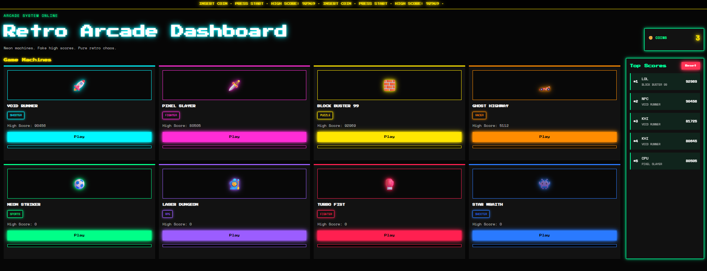

# Retro Arcade Dashboard

A neon-styled retro arcade launcher built with HTML, CSS, and vanilla JavaScript.

## Live Demo

https://fazal305.github.io/retro-arcade-dashboard/

## Project Overview

Retro Arcade Dashboard recreates the feel of an old arcade cabinet interface in the browser. It includes fake game machines, coins, loading bars, generated scores, persistent high scores, a scoreboard, Web Audio API beeps, vibration feedback, and neon visual effects.

The project is front-end only and works without a build step or external framework.

## Screenshot



## Features

- Eight fake retro arcade game cards
- Unique neon accent color for each machine
- Coin-based play system
- Add coins button when balance reaches zero
- Fake loading animation before each generated score
- Top five scoreboard
- Per-game high score tracking
- localStorage persistence
- Reset scoreboard system
- Web Audio API sound effects
- Mobile vibration feedback when supported
- Scrolling arcade marquee
- Responsive dashboard layout

## Included Games (Simulated Cabinets)

| Game            | Genre   |
| --------------- | ------- |
| VOID RUNNER     | SHOOTER |
| PIXEL SLAYER    | FIGHTER |
| BLOCK BUSTER 99 | PUZZLE  |
| GHOST HIGHWAY   | RACER   |
| NEON STRIKER    | SPORTS  |
| LASER DUNGEON   | RPG     |
| TURBO FIST      | FIGHTER |
| STAR WRAITH     | SHOOTER |

These eight cabinets are simulated: clicking Play spends a coin and
generates a random score. They are part of the original dashboard concept.

## Real Arcade Cabinets (Folded-In Games)

Nine fully playable games, each originally its own standalone repo, are
folded into this dashboard and served as self-contained static bundles
under `games/<slug>/`. They launch from the dashboard's "Real Arcade
Cabinets" section via `player.html`, which wraps each game in the
dashboard's own page chrome (a back-to-dashboard bar) and loads it in an
iframe.

| Game                         | Genre    | Source Repo                                                                             |
| ---------------------------- | -------- | ---------------------------------------------------------------------------------------- |
| Zombie Survival Choice Game  | RPG      | [zombie-survival-choice-game](https://github.com/fazal305/zombie-survival-choice-game)   |
| Connect Four                 | STRATEGY | [connect-four](https://github.com/fazal305/connect-four)                                 |
| Tetris (React)               | PUZZLE   | [tetris-react](https://github.com/fazal305/tetris-react)                                 |
| Imposter                     | PARTY    | [imposter-word-game](https://github.com/fazal305/imposter-word-game)                     |
| Boss Fight: Button Masher    | ACTION   | [boss-fight-button-masher](https://github.com/fazal305/boss-fight-button-masher)         |
| Reaction Speed Tester        | ARCADE   | [reaction-speed-tester](https://github.com/fazal305/reaction-speed-tester)               |
| Should I Do It?              | ORACLE   | [should-i-do-it](https://github.com/fazal305/should-i-do-it)                             |
| Roast Me Generator           | COMEDY   | [roast-me-generator](https://github.com/fazal305/roast-me-generator)                     |
| Fake Hacker Terminal         | SIM      | [fake-hacker-terminal](https://github.com/fazal305/fake-hacker-terminal)                 |

Connect Four, Tetris (React), and Imposter are React + Vite apps; they are
pre-built (`vite build --base=./`) into static bundles before being copied
into `games/<slug>/`, so the dashboard itself stays build-step-free. The
other six games were already plain HTML/CSS/JS and are copied in as-is.

## Controls

| Action                          | Result                                       |
| -------------------------------- | -------------------------------------------- |
| Click Play (simulated cabinet)   | Spend one coin and generate a score          |
| Click Play (real cabinet)        | Launch the actual game in the player view    |
| Add Coins                        | Refill the coin count                        |
| Reset                             | Clear saved scores and reset all high scores |

## Built With

- HTML5
- CSS3
- Vanilla JavaScript
- Google Fonts
- Web Audio API
- localStorage

## Project Structure

```text
retro-arcade-dashboard/
|-- index.html
|-- arcade-styles.css
|-- arcade-script.js
|-- games-real.js            # Metadata for the 9 folded-in real games
|-- real-games-script.js     # Renders the "Real Arcade Cabinets" cards
|-- player.html               # Launches a real game inside dashboard chrome
|-- player-script.js
|-- player-styles.css
|-- games/                    # One self-contained static bundle per real game
|   |-- zombie-survival-choice-game/
|   |-- connect-four/
|   |-- tetris-react/
|   |-- imposter-word-game/
|   |-- boss-fight-button-masher/
|   |-- reaction-speed-tester/
|   |-- should-i-do-it/
|   |-- roast-me-generator/
|   |-- fake-hacker-terminal/
|-- image.png
|-- README.md
|-- LICENSE
```

## Learning Notes

This project practices:

- DOM rendering from JavaScript arrays
- State management
- Sorting and limiting scoreboard data
- localStorage save/load behavior
- CSS Grid layouts
- CSS glow effects and animations
- Browser sound generation with Web Audio API
- Responsive UI design

## Author

Fazal Abbas

- GitHub: https://github.com/fazal305
- LinkedIn: https://www.linkedin.com/in/fazal-abbas-4653dg86

## License

This project is licensed under the MIT License.
